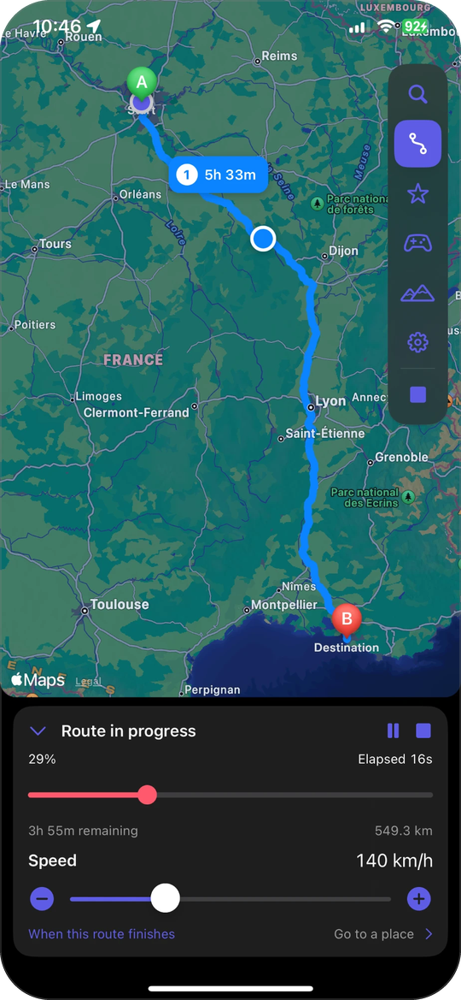
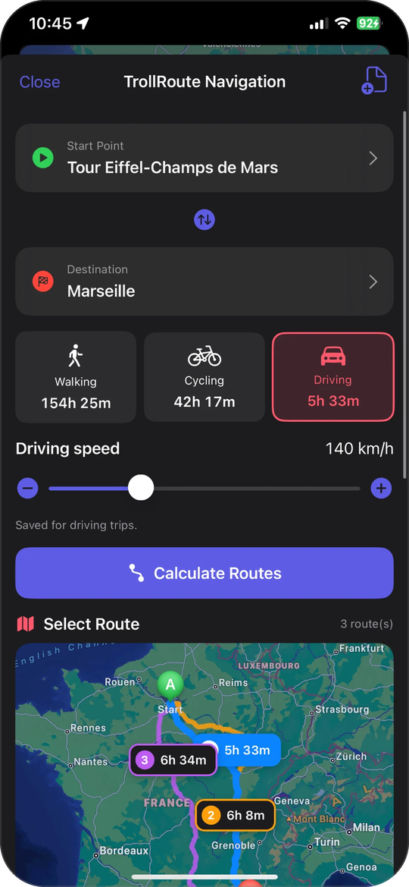
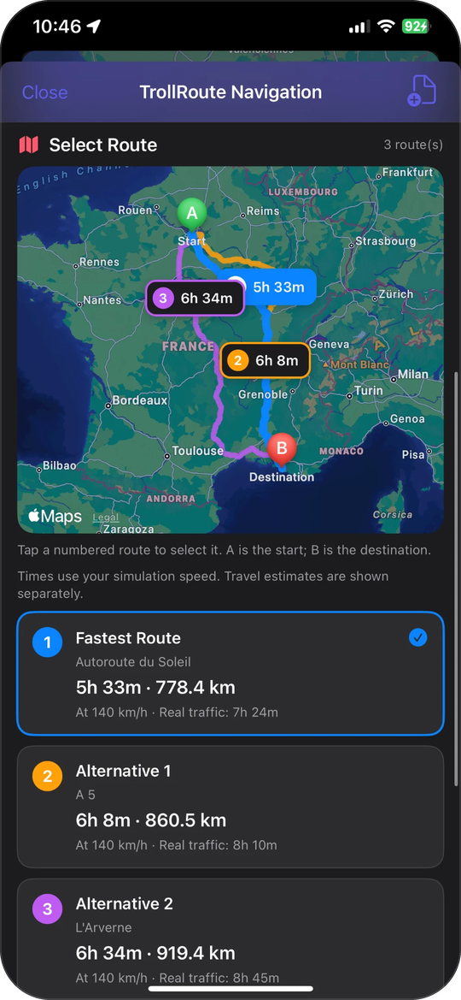
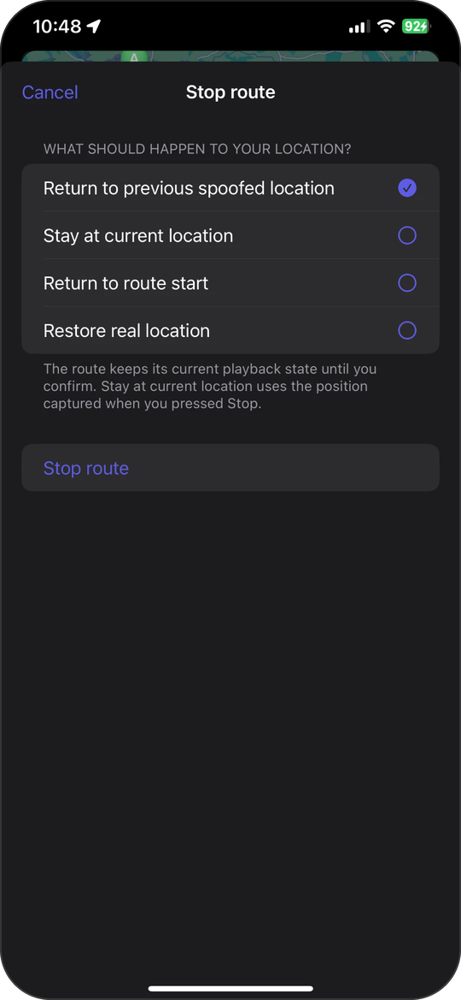
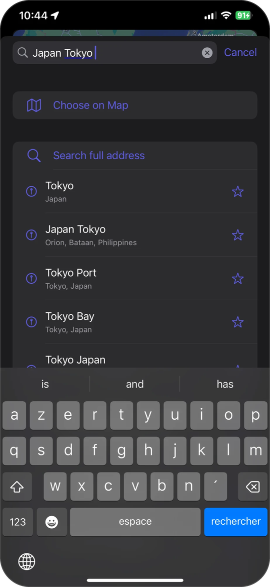
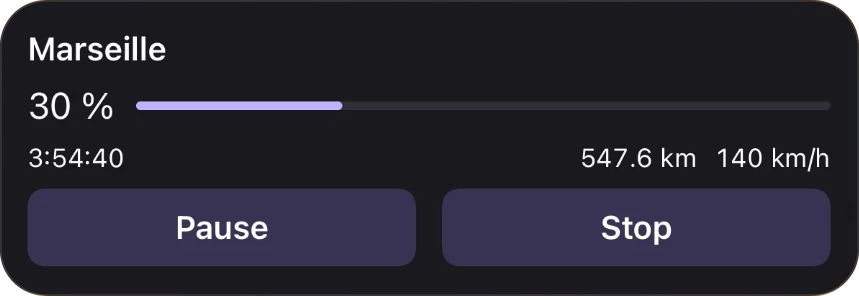
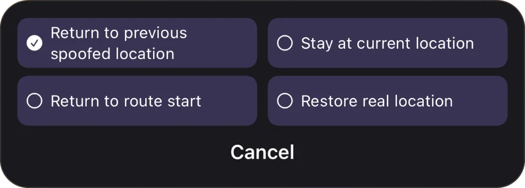

  

<h1 align="center">TrollRoute</h1>

  Put your iPhone anywhere in the world, or send it along a real route at the speed you choose. 
  A location simulator for <a href="https://github.com/opa334/TrollStore">TrollStore</a>, on iOS 15.0 to 17.0.

  <a href="https://github.com/dm2mymcszt-commits/TrollRoute/releases/latest"><b>Download the latest release</b></a>

  
  
  
  

## What it does

TrollRoute changes the location your iPhone reports to every app. Set a spot and stay there, or plan a trip and let the phone travel it: along real roads on foot, by bike or by car, at any speed from 1 to 500 km/h, or by plane from one airport to another.

Three things matter most here. Your location never changes by accident. Stopping a route never sends you back to your real position by surprise. And the movement other apps see (speed, heading, altitude) stays consistent.

## Features

### Go anywhere

- Search any address or place in the world.
- Paste a Google Maps or Apple Maps link, coordinates, or a plus code.
- Share a place from Google Maps or Apple Maps straight to TrollRoute: go there, use it as a route start or destination, or save it.
- Keep favorites and pick them wherever a place is asked for.
- Move by hand with the joystick, or import a GPX file.

### Travel a route

- Walking, cycling and driving routes, with alternatives. Each mode remembers its own speed.
- Fly between airports. TrollRoute picks the nearest of 4,134 airports at each end (you can choose others), follows the real great-circle path, and climbs, cruises and descends with matching speed and altitude.
- Drag the progress bar to jump anywhere on the route, change speed while moving, pause and resume.
- Decide what happens at the end: stay there, go to a saved place, return to your real location, loop, drive back, or go back and forth. You can change your mind while the route is running.
- Stopping a route asks where your location should go: back where it was before the route, where it is now, the route start, or your real location.
- Long press the map to plan a route to that point.
- History keeps your last 50 routes on the device, so you can run one again or delete it.

### The details

- Tapping the map does nothing unless you turn that on, and the main Stop button asks before restoring your real location.
- Altitude follows the terrain automatically, or uses a value you set. During a flight it follows the flight instead.
- On a long trip the time zone is refreshed as you travel.
- A notification tells you when a route finishes.
- A status screen shows TrollStore registration, location access and Precise Location, and explains what to change if something is off.

 

## Live Activity

  
  &nbsp;
  

A running route can show on the Lock Screen as a Live Activity: destination, progress, remaining time and distance, speed, with Pause and Stop. It is optional and off by default, and needs iOS 16.1 or later.

On iOS 17.0 the buttons act in place, and Stop offers the same choices as in the app. On iOS 16 they open TrollRoute. On a device with a Dynamic Island the activity appears there too.

## Install

1. Install [TrollStore](https://github.com/opa334/TrollStore) on a supported device.
2. Download the `.tipa` from the [latest release](https://github.com/dm2mymcszt-commits/TrollRoute/releases/latest).
3. Open it with TrollStore.

TrollRoute works wherever TrollStore does from iOS 15.0 up: iOS 15.0 to 16.6.1, 16.7 RC (20H18) and 17.0. It cannot be installed with ordinary sideloading, because simulating the location needs permissions only TrollStore can grant.

### Coming from Andromeda

TrollRoute is a separate app, so it installs next to Andromeda. On first launch it offers to import your favorites, recent places and settings. Nothing in Andromeda is changed. Once you have checked the import, you can delete Andromeda.

## Good to know

- **Search** uses Apple Maps and OpenStreetMap data, not Google's place database. For a place only Google Maps finds, share it from Google Maps to TrollRoute.
- **Privacy**: no account, no ads, no analytics. Network requests go to Apple Maps and to the search, routing and elevation services listed in the [data credits](THIRD-PARTY-NOTICES.md). A pasted short link is opened once to read where it points.
- **Dynamic Island**: the Live Activity has not been tested on a physical device with a native Dynamic Island. [DynamicCowTS](https://github.com/matteozappia/DynamicCowTS) is a separate tool that can add one on other devices; it is not part of TrollRoute.

## Building

There is no local build to set up: every push is built by GitHub Actions on macOS, which runs the tests and produces the `.tipa`. The packaging script is [`ipabuild.sh`](ipabuild.sh). Details and the on-device checklist are in [BUILD-TROLLSTORE.md](BUILD-TROLLSTORE.md), and what has and has not been verified is in [VERIFICATION.md](VERIFICATION.md).

## Credits and license

TrollRoute is based on [Andromeda](https://github.com/Son3ra1n/Andromeda) by son3ra1n, itself based on [Geranium](https://github.com/c22dev/Geranium) by c22dev. It is released under the [GPL-3.0 license](LICENSE.md).

Map, address, routing and elevation data: Apple Maps, © OpenStreetMap contributors and the other sources listed in [THIRD-PARTY-NOTICES.md](THIRD-PARTY-NOTICES.md).
